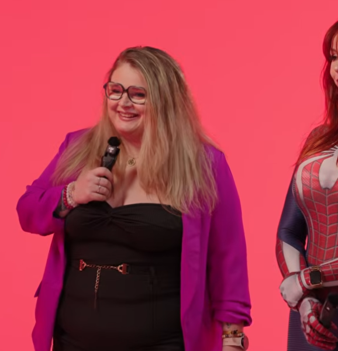
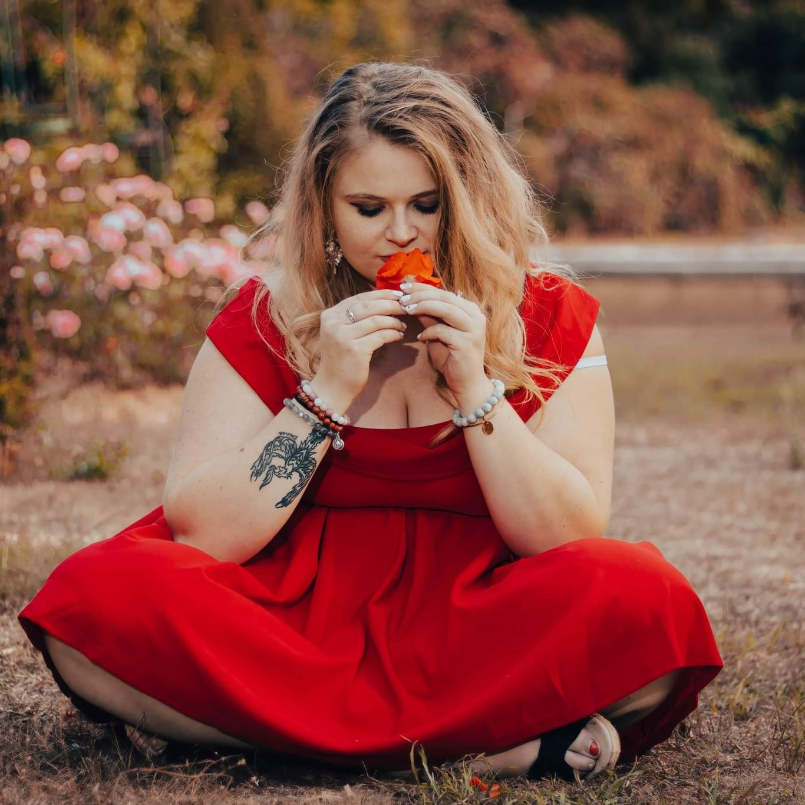
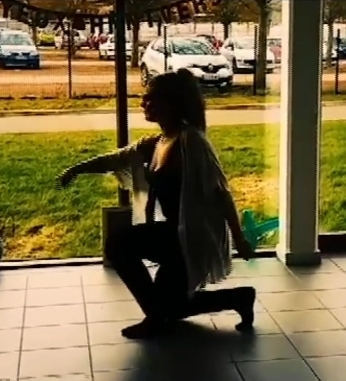
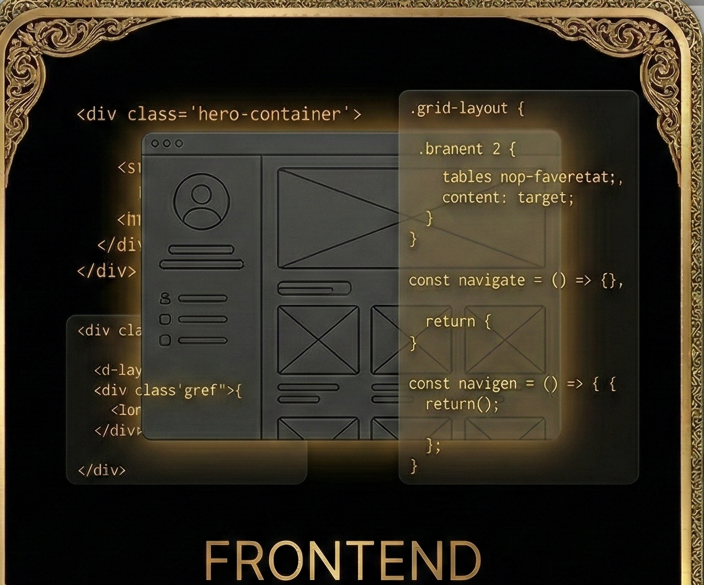
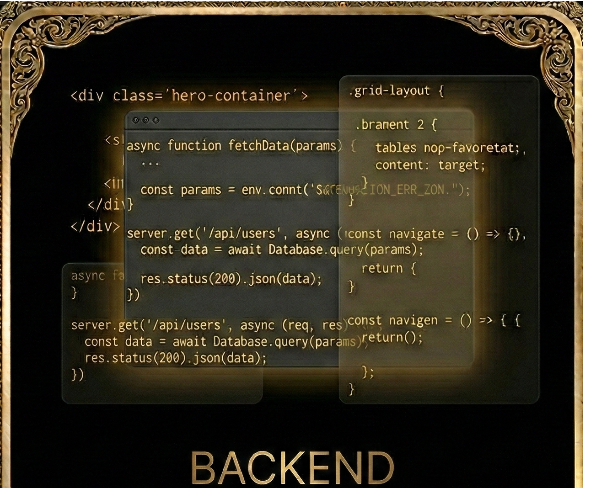
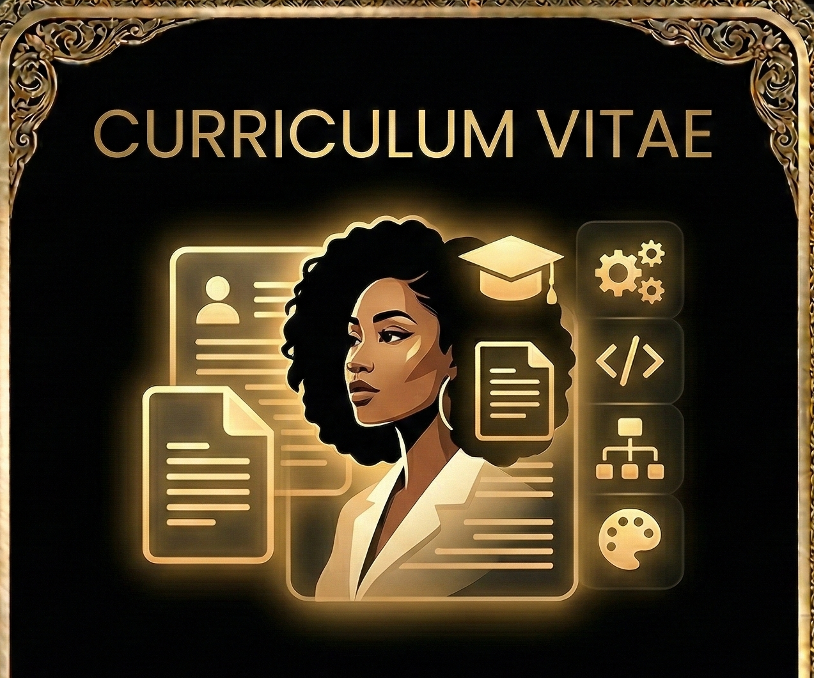

## Acting

- preview: /assets/videotournage.mp4
- video: https://youtu.be/qHGICrdWgl0?si=pG31IUUepsQDbHbz

 Mon parcours devant la caméra n'a pas commencé par un script, mais par un défi envers moi-même. Suite à une prise de poids, j'ai choisi l'objectif des photographes comme thérapie pour apprendre à m'aimer à nouveau. Ce qui a débuté comme une quête de confiance en soi s'est transformé en une véritable révélation.

Élue 1ère Dauphine Miss Plus Size Hauts-de-France, cette expérience a agi comme un tremplin, me prouvant que la beauté réside dans l'authenticité et la présence. C'est lors de ce cheminement qu'une casteuse a décelé mon potentiel et m'a offert mon premier rôle pour une vidéo YouTube.

Un an plus tard, cette même confiance professionnelle s'est confirmée lorsqu'elle m'a recontactée pour un nouveau projet. Aujourd'hui, chaque tournage est pour moi l'occasion de mêler ma sensibilité artistique à cette force intérieure que j'ai bâtie, avec la volonté de porter des messages de diversité et de résilience à l'écran.

## Dauphine

images: /assets/Miss.jpg, /assets/2.jpg, /assets/3.jpg, /assets/4.JPG, /assets/5.JPG

Tout a commencé par un simple besoin de me réconcilier avec mon reflet. Après une prise de poids, j’ai décidé de ne plus me cacher, mais de faire de l'objectif mon allié. Ce qui devait être une thérapie personnelle est devenu un engagement public : prouver que la beauté n'a pas de taille unique.

Élue 1ère Dauphine Miss Plus Size Hauts-de-France, j’ai découvert une force que j’ignorais posséder. Ce titre n’est pas une fin en soi, c’est une plateforme pour crier que nos "différences" sont en réalité nos plus belles signatures. Je prône l’acceptation de soi, non pas comme un renoncement, mais comme une célébration de notre authenticité.

Dans mon travail de développeuse, je porte cette même vision : je ne construis pas que du code, je cherche à créer des solutions inclusives et humaines. Ma rigueur technique est nourrie par cette bienveillance que j'ai apprise sur les podiums. Aujourd'hui, je suis fière d'être cette femme plurielle, capable d'allier l'exigence du développement logiciel à la douceur d'un message engagé.

## Shooting
- *Artiste* | Mar'23 - Avr'23
- 
- Tags: Category 1
- Badges:
  - Acting [blue]
- List Items:
  - Détail du projet 3

## Danse
- *Artiste* | Avr'23 - Mai'23
- 
- Tags: Category 1
- Badges:
  - Shooting [blue]
- List Items:
  - Détail du projet 4

## Frontend
- *Dev* | Juin'23 - Juil'23
- 
- Tags: Category 1
- Badges:
  - React [blue]
- List Items:
  - Projet digital 1

## Backend
- *Dev* | Juil'23 - Août'23
- 
- Tags: Category 1
- Badges:
  - Figma [blue]
- List Items:
  - Projet digital 2

## Curriculum Vitae
- *Dev* | Août'23 - Sept'23
- 
- Tags: Category 1
- Badges:
  - Code [blue]
- List Items:
  - Projet digital 3